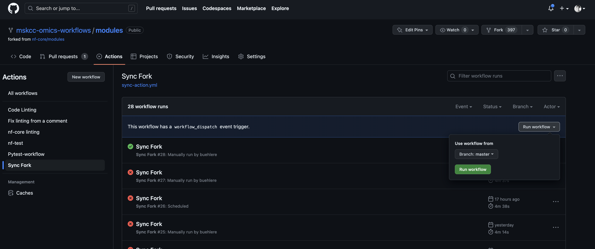

# Repo Overview

Repository: [mskcc-omics-workflows/modules](https://github.com/mskcc-omics-workflows/modules) &#x20;

## Syncing with nf-core/modules

In order to keep sync with `nf-core/modules`, we use a [gitaction workflow](https://github.com/mskcc-omics-workflows/modules/blob/master/.github/workflows/sync-action.yml) that runs once a day at midnight. The workflow uses the `tgymnich/fork-sync@v1.8` action to sync our repo's `master` and `develop` branches with the master branch of `nf-core/modules`. \
\
We sync `develop` to ensure it accurately mirrors `mskcc-omics-workflows/master`, as it is constantly pulling from `nf-core/master`. In theory, this should helps cut down on the conflict resolution that has to be done before `develop` can be pushed to `mskcc-omics-workflows/master.`

A great feature of the `tgymnich/fork-sync@v1.8` action is whenever a conflict between `mskcc-omics-workflows` and `nf-core` does arise it automatically creates a PR where a repository admin can resolve the conflict. Conflicts should be uncommon, but not necessarily rare and thus there is some active oversight that will need to be done in the maintenance of the repository.&#x20;

The action can also be run manually through the github GUI: \

<figure><figcaption></figcaption></figure>

## Adding a Module

1. First make a branch from master with the following naming convention: `feature/module_name`
2. On the new feature branch run the following: `nf-core modules create <module_name>`
3. Write your module. Please consult the [nf-core official documentation](https://nf-co.re/developers/tutorials/dsl2\_modules\_tutorial) for how to do this.
   * Note you can ignore the **Fork the nf-core/modules repository and branch,** **Pull Request and Test Data** sections in the nf-core documentation. We are covering how to make a Pull Request into MSK's fork of nf-core and add test data in this section.
   * It may also be useful to reference the [nextflow official documentation](https://www.nextflow.io/docs/latest/index.html) as well.&#x20;
4. Add test data to the [tools-test-data](https://github.mskcc.org/MSKCC-Omics-Workflows/tools-test-dataset) enterprise repository. Tools-test-data is a submodule in mskcc-omics-workflows/modules and can be accessed with the following: `git submodule update --init --recursive`\
   In some cases, test data may be too big for tools-test-data. In these cases more custom     solutions may be required. These might include hosting the data somewhere else and installing when testing the module, or perhaps foregoing test data in cases when testing in non-HPC environments is not feasible.&#x20;
5. Merge into the develop branch. The develop branch is review protected. It will require a review from a member of a participating team.&#x20;

## What to do if there is a need to edit an nf-core module?&#x20;

1. **Do not edit modules that are pulled from nf-core directly;** aka those modules which are not specific to this MSK fork. Otherwise, we risk moving out of sync with nf-core/modules repository.&#x20;
2. Instead, we suggest opening a PR directly to nf-core/modules to address the needed change. See [nf-core contribution guidelines](https://nf-co.re/docs/contributing/tutorials/dsl2\_modules\_tutorial#introduction).
3. If this fails and contributing to nf-core/modules is not an option. We suggest creating a new module (see the **Adding a Module** section), manually copying the module of interest and then editing. The newly created module should use the following naming convention: `msk/<primary_tool><command>`. For example, if I needed to edit `picard/cleansam`, I would run the following to get started:  `nf-core modules create msk/picardcleansam`. Unfortunately as of right now, nf-core only allows a depth of one for sub folders so the primary tool and command must be concatenated. This is less than ideal however highlights another reason why we want to avoid doing this.&#x20;

## Creating a Pipeline

* nf-core create pipeline name
* Currently investigating having a more generic template: [https://github.com/nf-core/tools/issues/2285](https://github.com/nf-core/tools/issues/2285)

## Installing Module/Subworkflows in a Pipeline

### installing modules:

`nf-core modules --git-remote https://github.com/mskcc-omics-workflows/mskcc-modules.git --branch <branch> install <module_name>`

### installing subworkflows:&#x20;

`nf-core subworkflows --git-remote https://github.com/mskcc-omics-workflows/mskcc-modules.git --branch <branch> install <subworkflow_name>`

This should install all modules associated with the subworklows.

**\*Note you will have to authenticate**

Use the following command to not be prompted for credentials:&#x20;

`nf-core subworkflows --git-remote https://<username:password>@github.com/mskcc-omics-workflows/mskcc-modules.git --branch <branch> install <subworkflow_name>`\

